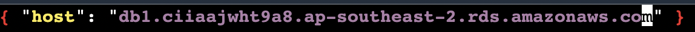

# FIT3170 AWS Workshop!

Code and instructions for interactive workshop learning AWS EC2, S3, RDS and Lambda

# Instructions

## Getting started

There is no need to clone this repo to your local machine - we'll clone it to a remote server to work with in a bit.

Keep this readme open in a browser tab to refer to as we go through the workshop.

Important: you very much need to either do the whole workshop interactively or none of it - as everything we do relies on previous things we did. We'll stop to do some troubleshooting periodically if needed and give people time to catch up, but don't expect that you'll be able to follow along if you join half way in.

## Expectations

By the end of this workshop, assuming we get through everything we plan to, you'll have a basic knowledge of:

- AWS as a whole
- AWS EC2 for running servers
- AWS S3 for hosting static websites and files
- AWS RDS for hosting a database
- AWS Lambda and the idea of serverless

You are already expected to:

- Have a basic understanding of how the linux command line works
- Be able to edit files from the command line (with vim, nano etc) - nano is pretty easy to work out if you're not sure
- Be able to navigate complex UIs following instructions
- Be able to take commands to run and substitute in values specific to your environment (e.g. host names)
- Helpful: basic knowledge of yarn as a package manager, as it's used quite a bit

Other than that, no specific technologies or languages are assumed knowledge. The app we are running is built in NodeJS on the back end and React on the front end, but you don't actually need to know these in order to get it running. Feel free to poke around the codebase if you like, but understand that it's built to be very simple for the sake of a demo - production applications are a lot more complex and polished.

## Step 1: setting up your AWS account

You will need access to a credit/debit card for this, but you won't actually get charged (just a $1 holding charge that will be refunded in a day or two). We'll also shut everything down completely at the end (and optionally, there's instructions on how to completely close your entire AWS account), so don't worry about getting billed. Furthermore, all the services we are using come under the "free tier" - a year of free services including file storage, server hours, etc. If you still don't like this, just watch me or the person next to you instead - unfortunately there is no way to create an AWS account without attaching a card.

Here are the steps:

1. Go to https://portal.aws.amazon.com/billing/signup
2. For "Root user email address", just put your uni email address (optionally, add a +something to the authcate to identify the account more specifically e.g. jsmi0001+aws@...)
3. Give your account a name - whatever you like
4. Verify your email with the 6 digit code that was sent
5. Select "personal" for the account type
6. Enter your phone number
7. Enter your country
8. Enter your address
9. Agree to the terms
10. Enter your card details
11. Enter your phone once more, select text verification
12. Verify your phone number with the 4 digit code
13. Choose free/basic support
14. Sign up is done!

Now, click "go to management console" and log in with your "root user" details.

Finally, you'll see a region listed in the top-right to the left of your account name. Usually by default it is N. Virginia. This is too far away for us - click the region and update it to Asia Pacific (Sydney) which is the closest to us and will result in the fastest load times and lowest server pings.

## Step 2: Launching an EC2 Server

Now we're going to launch a server which can host both the front end and back end of our app.

1. Using the search bar at the top of the console, search for EC2 and click it. This will take you to the EC2 console. In general you can navigate between services using this search bar.
2. Click "instances".
3. Click "launch instances".
4. For the name, choose whatever you like - e.g. "best Monash units".
5. Leave all the other configuration as default and click "launch instance".
6. You will be warned about proceeding without a key pair. This is fine, select "proceed without key pair" and click "proceed without key pair".
7. Once again, click "launch instance".
8. Click "view all instances".
9. Wait for the instance to launch - this should only take a minute or so.

## Step 3: Installing the app on the server

We now need to log in to the server and set it up with our app.

1. Tick the instance
2. Click "connect"
3. EC2 Instance Connect should be the active tab by default. This is what we want - it allows us to connect to the instance in a browser without having to worry about SSH keys. Leave the options as default and click "connect".
4. Install git: `sudo yum install -y git`
5. Clone this repository: `git clone https://github.com/chloebrett/fit3170`
6. Navigate into the repository: `cd fit3170`. Note that from now on, when I say to navigate to a particular folder, assume it is defined relative to the repository root. For example "navigate to `backend-json`" means go to the folder with absolute path `/home/ec2-user/fit3170/backend-json`. You can see your absolute path at any point with the `pwd` command.
7. Run the install script: `sudo ./install.sh`. This installs a number of dependencies required by the app.

## Step 4: Running the app

First, start the back end. The `backend-json` folder contains a basic back end which stores data in a JSON file and doesn't need a full database. We'll use this to start, before replacing it with `backend-database` later once we have a database running. Here's how to get `backend-json` running:

1. `cd backend-json`
2. `yarn start`

That's it! You should see a message saying "App listening on 3001" if everything worked as expected.

Next, to start the front end, the easiest way to do this is by launching another "instance connect" session as follows:

1. Go back to the EC2 instances tab, select your instance and select "connect", then select "connect" again.

This is necessary so that we can leave the back end running while we get the front end started. So, finally, we can launch the front end from this second session:

1. `cd fit3170` to get to the cloned repository
2. `cd frontend`
3. `sudo yarn serve` (don't forget the `sudo`!)

This will build the front end of the app and serve the contents over HTTP on port 3000.

If all succeeds, you should get a message like this:

```
ERROR: Cannot copy server address to clipboard: Couldn't find the `xsel` binary and fallback didn't work. On Debian/Ubuntu you can install xsel with: sudo apt install xsel.

   ┌───────────────────────────────────────────────────┐
   │                                                   │
   │   Serving!                                        │
   │                                                   │
   │   - Local:            http://localhost:3000       │
   │   - On Your Network:  http://172.31.32.185:3000   │
   │                                                   │
   └───────────────────────────────────────────────────┘
```

Ignore the error, it's not a problem. As for the URL you were given, for example http://172.31.32.185:3000, copy-paste it into your clipboard and paste it into your browser! Does it work?

## Step 5: Accessing the app

The answer to the above question of "does it work" should be "nope" - the page will probably just hang indefinitely. There are two reasons for this:

1. The IP address given is a private IP address and is not publicly accessible - you need the public address instead.
2. The instance is not configured to accept HTTP traffic, so it will reject it even if we had the right address.
3. The front end is not even pointed at the back end properly right now, so we need to fix that too.

Let's fix all of these problems now.

1. Go back to the EC2 console.
2. Go to the "instances" page and select your server instance.
3. In the instance info, look at the "details" tab. There should be a field called "Public IPv4 DNS" - something like `ec2-3-26-79-254.ap-southeast-2.compute.amazonaws.com`. Copy this and save it somewhere (e.g. a note or google doc).
4. Paste the copied URL into your browser, adding ":3000" to the end to specify port 3000, which is what the front end is hosted on. This fixes problem #1.
5. Now select the "security" tab.
6. You should see a security group with a name like "launch-wizard-1". Click it.
7. Click "edit inbound rules".
8. Click "add rule".
9. Leave the type as "custom TCP", set the port range to be `3000-3001` (this is extremely important to get right!), and set the source to be "anywhere-IPv4" from the dropdown.
10. I repeat, the above is very important to get right - it's easy to get wrong and if you do, your instance won't be reachable. See the photo below for what they should look like after.
11. Finally, click "save rules". This fixes problem #2.


Now let's fix problem #3:

1. Go back to your front end shell (the second instance connect window you opened).
2. Hit ctrl+C to stop the front end from being served so you can go back to running commands.
3. Type `nano src/config.json` (feel free to use another editor such as `vim` if you prefer) and edit the config so that the host value matches exactly the URL you pasted into your browser with the public DNS - except that instead of `:3000` at the end, we want `:3001` since this is the back end URL. We are doing this in order to point the front end to the back end correctly. Make sure there is an http:// at the start as well. Once done, hit ctrl+X then 'y' then enter to save the file.
4. Re-build and re-serve the front end with `sudo yarn serve` again.

This is what the `config.json` file should look like:


You should now be able to visit the URL you saved before (with the :3000 after it) and view the app!

That's it for the first part - we now have the app running on a server!

Next up is hosting the front end as a static website on S3.

## Step 6: Giving EC2 some extra permissions

Before we can get much further, we need to get command line access to AWS.

Normally, this is done by installing the command line tools to your local machine, setting up a user with appropriate permissions, and so on. But we're short on time, so we'll do it the quick and easy way: give the EC2 server we're using full command line access to our AWS account.

A bit of a warning here - this is not a good practice in general, and even for a small project it would be much better to give only the specific permissions that are needed. However, for the sake of this demo where will we shut down the instance within an hour, I think this is fine. Just be aware it's not a good security practice for production apps.

Here's how we do it:

1. Go to the EC2 console
2. Go to the "instances" page and tick our instance
3. Click actions -> security -> modify IAM role
4. Click "create a new IAM role"
5. Click "create role"
6. Select "AWS service" (should be default) and under "common use cases", select "EC2"
7. Click "next"
8. Search "AdministratorAccess" and tick the policy called "AdministratorAccess"
9. Click next
10. Give the role a name - e.g. "ec2admin"
11. Scroll to the bottom and click "create role"
12. Close the tab and go back to the previous tab where you clicked "create new IAM role" from
13. Click the refresh button next to the "choose IAM role" dropdown
14. Select the "ec2admin" role you created
15. Click "update IAM role"

## Step 7: Creating the S3 bucket and hosting the front end in it

To create the bucket and enable static web hosting:

1. Go to the S3 console (via searching "S3" in the top search bar)
2. Click "Create bucket"
3. Name the bucket whatever unique name you like - bucket names are globally unique. Example: fit3170-chloe
4. Leave the "ACLs disabled" setting as default
5. Untick the "block all public access" checkbox
6. Tick "I acknowledge" 
7. Leave the other settings as default and click "create bucket"
8. Click the bucket you just created
9. Click "properties"
10. Scroll to the bottom where it says "static website hosting"
11. Click "edit" then select "enable"
14. Type "index.html" for the index document
15. Leave the other values as default
16. On the properties panel, the “static website hosting” should now have a “bucket website endpoint”. Click this to open this in a new tab. We haven't uploaded the web app or properly set permissions yet so you'll get a 403 error - but keep this tab open as we'll use it later.

Next, change the bucket policy to allow access to all objects:

1. Go to the permissions tab in the bucket -> bucket policy -> edit
2. Paste the following, replacing "example-bucket" with your bucket name:

```
{ "Version":"2012-10-17", "Statement":[{ "Sid":"PublicReadGetObject", "Effect":"Allow", "Principal": "*", "Action":["s3:GetObject"], "Resource":["arn:aws:s3:::example-bucket/*"] }] }
```

Make sure to leave the "/*" at the end of the bucket name. Save the policy.

Then, upload the front end to the bucket for hosting:

1. Go back to your front end shell session
2. Stop the front end from running if it's running (ctrl+C)
3. Run `aws s3 cp --recursive build s3://example-bucket`, replacing `example-bucket` with your bucket name. This will upload the `build` folder to S3.
4. Go to the page where you opened the static website before and refresh it - it should work now!

Cool - so now we have the back end running on EC2 still, and saving things to a local JSON file, while the front end is statically hosted on S3. Nice! Next up is to improve reliability by storing data on a remote database instead of just in a JSON file - so that if our server dies, we can just replace it with another one that connects to the same database, and no data will be lost!

## Step 8: Replacing the JSON file store with an actual database

Here's what we need to do to add a database:

1. Search “rds” in the main aws search bar to go to the RDS console (RDS stands for Relational Database Service)
2. Select “instances”
3. Select “create database”
4. Select "standard create"
5. Select "postgresql"
6. DB instance size should be “free tier”
7. Call the DB whatever you like
8. Leave master username as "postgres"
9. Make the password "postgres" as well for simplicity (this is how the back end is configured to access it) - obviously in production a more complex password would be used.
10. Leave the storage as default
11. Use the default VPC and subnet group
12. Important: set "public access" to "YES"
13. Leave the VPC security group and availability zone as default
14. Leave the authentication as default
15. Click “create database”!
16. This can take a little while (2-3 mins) - unfortunately we do need to know the endpoint before we can configure the back end to connect to the database. So while everyone's databases boot up, I'll go around the room (and the Zoom) to make sure everyone's caught up.

Here's how to connect the back end up to the DB, once your DB is running:

1. From the RDS management console, click your DB
2. In the "connectivity & security" tab (the default one), there is an "endpoint" listed. Copy it to your clipboard
3. Go to your back end shell / instance connect session
4. Stop the current back end from running if it is running (ctrl+C)
5. Navigate to `backend-database` instead of `backend-json`
6. Update the hostname in `dbconfig.json` using nano or vim to be the endpoint you just copied. No need for http:// or a port - in fact this is a postgres URL so it's not even using the HTTP protocol anyway.

It should look something like this:



Now get the database-capable back end running:

1. Stay in the `backend-database` folder
2. Run `knex migrate:up` to automatically create the required tables in the database
3. Start the back end with `yarn start`

Now you can visit the same front end as before, and it will access the new back end, which is talking to a database instead of just saving data to a JSON file. Nice!

There is one more missing link before we can retire the server entirely - the back end is still running on it! In fact it is possible for this app to run everything without explicitly handling servers ourselves, and that's what we'll do in the next step.

## Step 9: Running the back end serverlessly with Lambda

Here's how we can replace the back end with a serverless version:

1. Go to your back end instance and stop it (ctrl+C)
2. Go to the `backend-lambda` folder instead of the `backend-database` one
3. Copy the db config file: `cp ../backend-database/dbconfig.json dbconfig.json` - this is because the serverless version needs the same DB credentials as the `backend-database` that runs on a server.
4. Run `yarn deploy` to deploy the serverless app

This will take a little while. Once it's done, you should get an output something like this:


Copy one of the endpoints to your clipboard, without the /units path at the end. For example:

```
https://jvhws71uuh.execute-api.ap-southeast-2.amazonaws.com/development
```

Make sure it starts with "https://" and ends with "/development".

Next we need to tell the front end to point to this new back end.

1. Go to the front end shell
2. Navigate to the `frontend` folder
3. Using nano or vim, open `src/config.json` and update the `host` to be the serverless endpoint you copied before
4. Run `cat src/config.json` to confirm the update worked - you should see the new host printed
5. Run `sudo yarn build` again to re-build the front end with the new config
6. Run `aws s3 cp --recursive build s3://example-bucket` again, replacing `example-bucket` with the name of your bucket, to update the statically hosted site with the new config

If all goes to plan, the static site should now point to the lambda endpoint instead of the server back end - you can verify this by checking requests in the Network tab in the Chrome inspector. Don't shut down the server just yet, as it will help us shut down other things for packing up, but in theory we don't need it anymore as everything is running serverlessly (well, not the database, but at least we don't have to manage the server ourselves).

## Step 10: Cleaning everything up

Now it's time to clean things up, so we don't get unexpected charges in a year's time when our AWS free tier expires.

Shutting down the serverless back end:

1. Go to the back end shell / instance connect session
2. Go to the `backend-lambda` folder
3. Run `serverless remove` to destroy the serverless application resources

Shutting down the database:

1. Go to the RDS console
2. Select “DB instances”
3. Tick the DB you made
4. Click actions -> delete
5. Uncheck “create final snapshot” and “retain automated backups”
6. Check “I acknowledge”
7. Type “delete me” into the field and click delete

Emptying and deleting the S3 bucket:

1. Go to the S3 console
2. Tick the bucket you made
3. Click “empty”
4. type “permanently delete” and click “empty”
5. Click “exit”
6. Tick again if not already ticked
7. Click “delete”
8. Type the name of your bucket to confirm deletion then click “delete”

Shutting down the S3 instance:

1. Go to the EC2 console -> instances
2. Tick the instance you made
3. Click "instance state" -> "terminate instance"
4. Click “terminate”

All done - technically there are a few resources still hanging around (e.g. the IAM role we made), but they're free forever and don't really affect anything if they're not in use, so we'll leave them.

Optional: delete your entire AWS account

1. Click your account name in the top right corner
2. Click “account”
3. Scroll to the bottom
4. Check all the checkboxes
5. Click “close account”

Thanks for following the workshop!!!
