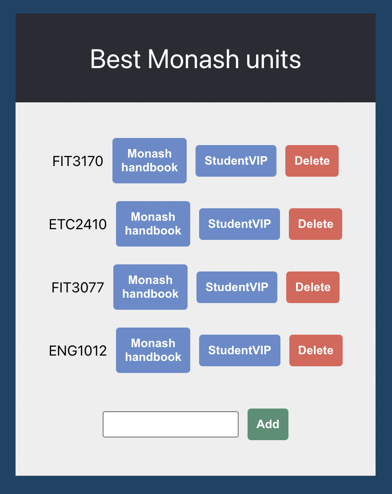

# FIT3170 AWS Workshop!

Code and instructions for interactive workshop learning AWS EC2, S3, RDS and Lambda

## What we'll be doing

We'll be deploying a web app that looks like this:

To start with, we'll run everything on an Amazon EC2 server - both the front and back end.

Next, we'll replace the front end with a static website hosted on Amazon S3.

Then, we'll start storing the data on an external database, rather than locally on the server, using Amazon RDS.

Finally, we'll retire the server entirely by replacing the back end with a serverless API hosted on AWS Lambda - leaving us with a purely serverless application that can scale (almost) indefinitely!

## Getting started

There is no need to clone this repo to your local machine - we'll clone it to a remote server to work with in a bit.

There is also no need to have an AWS account yet - we'll walk through the setup as part of the workshop.

Keep this readme open in a browser tab to refer to as we go through the workshop.

Important: you very much need to either do the whole workshop interactively or none of it - as everything we do relies on previous things we did. We'll stop to do some troubleshooting periodically if needed and give people time to catch up, but don't expect that you'll be able to follow along if you join half way in.

## Expectations

By the end of this workshop, assuming we get through everything we plan to, you'll have a basic knowledge of:

- AWS as a whole
- AWS EC2 for running servers
- AWS S3 for hosting static websites and files
- AWS RDS for hosting a database
- AWS Lambda and the idea of serverless

You are already expected to:

- Have a basic understanding of how the linux command line works
- Be able to edit files from the command line (with vim, nano etc) - nano is pretty easy to work out if you're not sure
- Be able to navigate complex UIs following instructions
- Be able to take commands to run and substitute in values specific to your environment (e.g. host names)
- Helpful: basic knowledge of yarn as a package manager, as it's used quite a bit

Other than that, no specific technologies or languages are assumed knowledge. The app we are running is built in NodeJS on the back end and React on the front end, but you don't actually need to know these in order to get it running. Feel free to poke around the codebase if you like, but understand that it's built to be very simple for the sake of a demo - production applications are a lot more complex and polished.

* Step 1: [Setting up your AWS account](./instructions/Step1.md)
* Step 2: [Launching an EC2 Server](./instructions/Step2.md)
* Step 3: [Installing the app on the server](./instructions/Step3.md)
* Step 4: [Running the app](./instructions/Step4.md)
* Step 5: [Accessing the app](./instructions/Step5.md)
* Step 6: [Giving EC2 some extra permissions](./instructions/Step6.md)
* Step 7: [Creating the S3 bucket and hosting the front end in it](./instructions/Step7.md)
* Step 8: [Replacing the JSON file store with an actual database](./instructions/Step8.md)
* Step 9: [Running the back end serverlessly with Lambda](./instructions/Step9.md)
* Step 10: [Cleaning everything up](./instructions/Step10.md)
