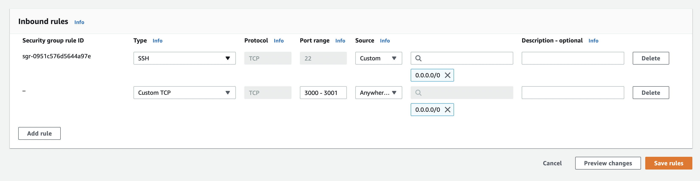
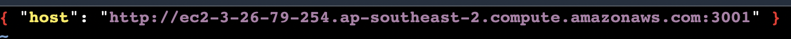

## Step 5: Accessing the app

The answer to the above question of "does it work" should be "nope" - the page will probably just hang indefinitely. There are two reasons for this:

1. The IP address given is a private IP address and is not publicly accessible - you need the public address instead.
2. The instance is not configured to accept HTTP traffic, so it will reject it even if we had the right address.
3. The front end is not even pointed at the back end properly right now, so we need to fix that too.

Let's fix all of these problems now.

1. Go back to the EC2 console.
2. Go to the "instances" page and select your server instance.
3. In the instance info, look at the "details" tab. There should be a field called "Public IPv4 DNS" - something like `ec2-3-26-79-254.ap-southeast-2.compute.amazonaws.com`. Copy this and save it somewhere (e.g. a note or google doc).
4. Paste the copied URL into your browser, adding ":3000" to the end to specify port 3000, which is what the front end is hosted on. This fixes problem #1.
5. Now select the "security" tab.
6. You should see a security group with a name like "launch-wizard-1". Click it.
7. Click "edit inbound rules".
8. Click "add rule".
9. Leave the type as "custom TCP", set the port range to be `3000-3001` (this is extremely important to get right!), and set the source to be "anywhere-IPv4" from the dropdown.
10. I repeat, the above is very important to get right - it's easy to get wrong and if you do, your instance won't be reachable. See the photo below for what they should look like after.
11. Finally, click "save rules". This fixes problem #2.

Now let's fix problem #3:

1. Go back to your front end shell (the second instance connect window you opened).
2. Hit ctrl+C to stop the front end from being served so you can go back to running commands.
3. Type `nano src/config.json` (feel free to use another editor such as `vim` if you prefer) and edit the config so that the host value matches exactly the URL you pasted into your browser with the public DNS - except that instead of `:3000` at the end, we want `:3001` since this is the back end URL. We are doing this in order to point the front end to the back end correctly. Make sure there is an http:// at the start as well. Once done, hit ctrl+X then 'y' then enter to save the file.
4. Re-build and re-serve the front end with `sudo yarn serve` again.

This is what the `config.json` file should look like:

You should now be able to visit the URL you saved before (with the :3000 after it) and view the app!

That's it for the first part - we now have the app running on a server!

Next up is hosting the front end as a static website on S3 - but first, let's give EC2 some extra permissions so that everything else works smoothly.

Next: [Giving EC2 some extra permissions](./Step6.md)
